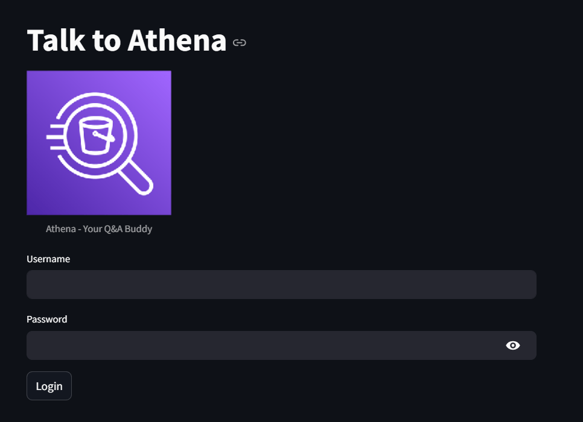

# Talk to Athena

This project is a Streamlit-based application that allows users to interact with AWS Athena using natural language queries. It leverages vector search with FAISS for efficient querying and LangChain for embeddings and text processing.

## Features

- User authentication with roles (admin and user)
- Metadata refresh from AWS Glue Data Catalog
- Vector store creation and management with FAISS
- Natural language query interface to AWS Athena
- Display of query results in a chat interface




## Requirements

- Python 3.8 or higher
- Streamlit
- boto3
- pandas
- langchain
- numpy
- yaml

## Installation

1. Clone the repository:

   ```bash
   git clone https://github.com/yourusername/talk-to-athena.git
   cd talk-to-athena

2. Create a virtual environment and activate it:
    ```bash
    python -m venv venv
    source venv/bin/activate  # On Windows use `venv\Scripts\activate`

3. Install the required packages:
    ```bash
    pip install -r requirements.txt

## Configurations
1. Create a config.yaml file in the root directory with the following structure:
    ```yaml
    metadata_file: "path_to_metadata_file"
    json_file_path: "path_to_users_json_file"
    output_location: "s3_output_location"
    bucket_name: "your_s3_bucket_name"
    folder_path: "path_to_faiss_index_folder"
    knowledge_layer_file: "path_to_knowledge_layer_file"
    faiss_local_paths:
        - "path_to_faiss_index_1"
        - "path_to_faiss_index_2"
    pkl_local_paths:
        - "path_to_pickle_file_1"
        - "path_to_pickle_file_2"

2. Create a users.json file for user authentication with the following structure:
    ```json
    [
    {
        "username": "admin",
        "password": "admin_password",
        "role": "admin"
    },
    {
        "username": "user",
        "password": "user_password",
        "role": "user"
    }
    ]

### Usage
1. Run the Streamlit application:
    ```bash
    streamlit run app.py
2. Open your web browser and navigate to the displayed URL (usually http://localhost:8501).
3. Log in using the credentials specified in the users.json file.
4. Use the sidebar to refresh metadata and interact with Athena by typing queries in the chat interface.

### Functions
- `refresh_vector_store_local(faiss_local_paths, pkl_local_paths, bucket_name, folder_path)`: Refreshes the local FAISS vector store by loading and merging indices.
- `main(faiss_index)`: The main function that handles metadata refresh, initializes the chat interface, and processes user queries.
- `verify_login(users, username, password)`: Verifies user login credentials.
- `get_llm()`: Initializes the language model.
- `get_response(llm, faiss_index, question)`: Generates a response to the user's question using the language model and FAISS index.
- `get_valid_query(llm, faiss_index, response, database, output_location)`: Validates and generates a query to be run on Athena.
- `run_athena_query(query, database, output_location)`: Runs the given query on AWS Athena and returns the result.

### License
This project is licensed under the MIT License. See the LICENSE file for details.
